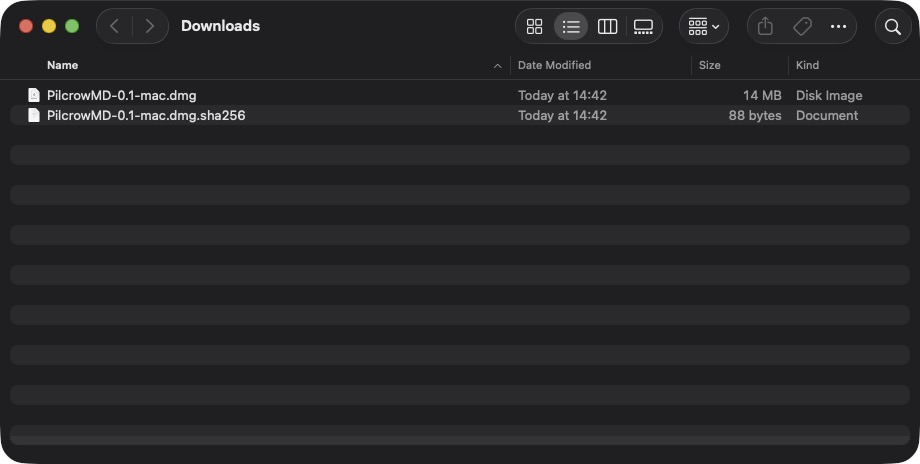
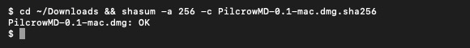
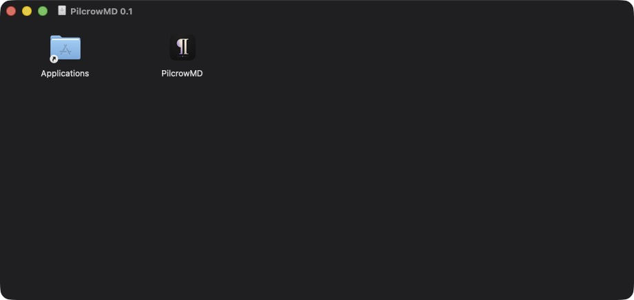
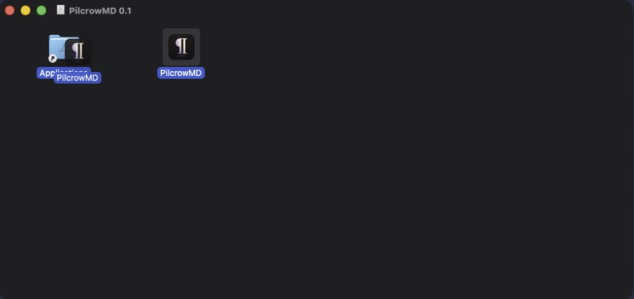
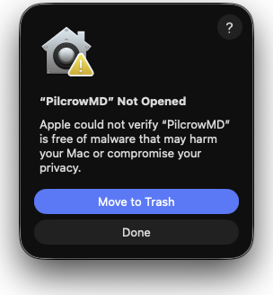
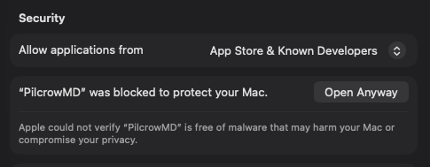
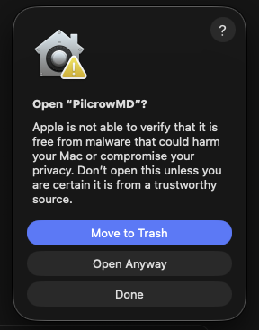

# Installing PilcrowMD (Mac)

PilcrowMD is a beta. It is not signed with a paid Apple developer
account, so macOS checks with you before the first open. The steps below get
you past that check. They are one-time: after the first launch, the app opens
normally.

(You may see the word "notarized" in this guide. Notarized means Apple has
checked an app and stamped it as safe. An app without a paid developer
account cannot be notarized – that is why macOS asks you to confirm instead.)

You need a Mac with macOS 14 (Sonoma) or later.

The download files are named `PilcrowMD-<version>-mac.dmg` – for example
`PilcrowMD-0.1-mac.dmg`. In the steps below, read `<version>` as that number.

## 1. Download

From the release page, download `PilcrowMD-<version>-mac.dmg` to your
Downloads folder.



## 2. Optional – check the download

This step is optional. It checks the download was not damaged on the way.

Download the `.sha256` file too. Open Terminal (in Applications › Utilities),
paste this line and press Return:

```
cd ~/Downloads && shasum -a 256 -c PilcrowMD-<version>-mac.dmg.sha256
```

It should answer `PilcrowMD-<version>-mac.dmg: OK`.



## 3. Open the DMG

Double-click the DMG file. A window opens with PilcrowMD and an Applications
shortcut inside.



## 4. Drag to Applications

Drag the PilcrowMD icon onto the Applications shortcut, then release.



You can then close the DMG window. In Finder's sidebar, under Locations,
click the eject button next to "PilcrowMD".

## 5. First open – blocked

Open PilcrowMD from your Applications folder. macOS blocks the first open
with a message:

> **“PilcrowMD” Not Opened** – Apple could not verify “PilcrowMD” is free of
> malware that may harm your Mac or compromise your privacy.

This is expected. Click **Done**. Do not click **Move to Trash** – that
deletes the app.



## 6. Privacy & Security – Open Anyway

Open **System Settings** › **Privacy & Security**. Scroll to the bottom, to
the **Security** section. There is a note:

> **“PilcrowMD” was blocked to protect your Mac.** Apple could not verify
> “PilcrowMD” is free of malware that may harm your Mac or compromise your
> privacy.

Click the **Open Anyway** button next to it.



## 7. Confirm

A box asks once more: **Open “PilcrowMD”?** with three buttons.
Click **Open Anyway**. Do not click **Move to Trash** – that deletes the app.



macOS then asks for your Mac password (or Touch ID). Enter it and confirm.

## 8. Done

PilcrowMD opens. From now on it opens normally, like any other app.


## Terminal alternative (advanced users)

If the Privacy & Security note does not appear (it can expire), this command
clears the way. It removes the quarantine mark macOS puts on downloaded
files:

```
xattr -dr com.apple.quarantine /Applications/PilcrowMD.app
```

Run it only on the copy you downloaded from this project's release page.

## Problems?

Tell us what happened: [open an issue on GitHub](https://github.com/pilcrowmd/pilcrow-mac/issues)
