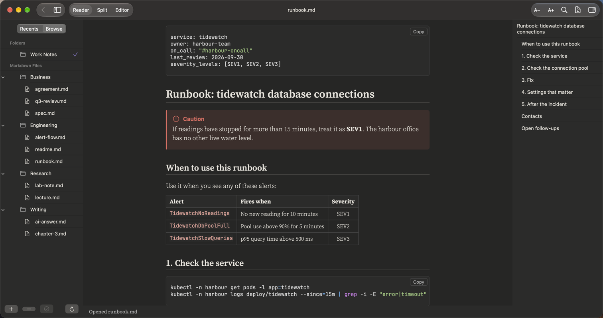

# PilcrowMD for Mac

A native Markdown reader and editor for the Mac. Open a `.md` file and read it the way it
was meant to look. Edit it, see the result side by side, export it to PDF.
Built for the age of AI agents: it watches your folders and shows every new or changed file
within a second.

**[Download PilcrowMD 0.1 beta (Mac)](https://github.com/pilcrowmd/pilcrow-mac/releases/tag/v0.1-beta)** ·
macOS 14 or later · free while the beta lasts · [How to install](INSTALL.md)


---

## What it shows, for whom

The same app, nine kinds of documents. Every picture is the real app showing one of our
example notes. Click a name to see three pictures and the full list for that kind of note.

| Who | What they write | What PilcrowMD draws for them | |
|:--|:--|:--|:--|
| **[Developers](docs/use-cases/developers.md)** | READMEs, API notes | Code in 28 languages with colours and a Copy button, tables, callouts, task lists, footnotes, collapsible sections |  |
| **[Admins and on-call](docs/use-cases/admins.md)** | Runbooks, incident notes | Warning and Caution callouts, shell and SQL with exact spacing, alert tables, checklists |  |
| **[Product](docs/use-cases/product.md)** | Specs, plans | Goal and priority tables, task lists, callouts, links between notes |  |
| **[Business](docs/use-cases/business.md)** | Reports, reviews | Tables with numbers aligned right, bold totals, numbered lists, the Light theme |  |
| **[Legal](docs/use-cases/legal.md)** | Agreements, clause reviews | Numbered clauses, a contents list with links, definitions tables, review comments in boxes, footnotes |  |
| **[Science](docs/use-cases/science.md)** | Lab notes | Formulas with subscripts, results tables, the chart picture inside the page |  |
| **[Maths](docs/use-cases/maths.md)** | Lectures, problem sets | Inline and display maths, matrices, aligned equations, cases |  |
| **[Writers](docs/use-cases/writers.md)** | Chapters, drafts | A calm serif page, italics and quotes, footnotes you can click, three font sets |  |
| **[AI answers](docs/use-cases/ai-answers.md)** | Saved answers from any AI assistant | Tables, steps, a formula, a checklist and code, as a page instead of raw symbols |  |

Try the same notes yourself: [samples](samples/).

---

## Every Markdown element it draws

| Element | You write | Notes |
|:--|:--|:--|
| Headings, **bold**, *italic*, ~~strike~~, `code` | `# Title`, `**bold**`, `*italic*` | |
| Lists and task lists | `- item`, `1. item`, `- [ ] to do`, `- [x] done` | Ticked and empty boxes |
| Quotes | `> quoted text` | |
| Tables | `\| a \| b \|` with `:--` / `--:` | Column alignment; wide tables scroll sideways |
| Code blocks | ` ```python ` | Colours for 28 languages, Copy button. Fence name in lower case. |
| Maths | `$x^2$`, `$$\frac{a}{b}$$` | Matrices, aligned equations, cases. A formula it cannot draw is shown as its source. |
| Footnotes | `text[^1]` | Click to jump and back |
| Callouts | `> [!NOTE]`, `[!TIP]`, `[!IMPORTANT]`, `[!WARNING]`, `[!CAUTION]` | |
| Collapsible sections | `<details><summary>…</summary>…</details>` | |
| Front matter | `---` block at the top | Shown as a box |
| Pictures | `` | Local pictures; web pictures are never downloaded |
| Links | `[text](other-note.md#heading)`, bare `https://…` | Between notes, to headings, to the web |
| Mermaid diagrams | ` ```mermaid ` | Off by default. When on, diagram text is sent to mermaid.ink to be drawn. |

Shown as plain text, never broken: `[[wiki links]]`, `==highlight==`, `:emoji:` codes, other
HTML. Full list, with what it does not do: [What it does](docs/what-it-does.md).

---

## Folders and agents

Add a folder. When an agent, a script or another app writes a file there, it appears with
**N** (new) or **U** (updated) within a second. An open note updates by itself.


If you are editing a file and an agent saves it too, PilcrowMD shows a banner and asks before
saving: **Save As… / Overwrite / Cancel**. Cancel writes nothing.


More: [Folders and agents](docs/folders-and-agents.md) · [AI agents use case](docs/use-cases/agents.md)

---

## Your files are safe

- Nothing is written unless you edit. A save is all-or-nothing.
- Another app's changes are never overwritten without asking you.
- No account, no tracking, no network – except Mermaid diagrams, which are off until you turn them on.

Like the Android app, the Mac app draws every page natively, with no web view or browser engine.
Details: [Your files are safe](docs/your-files-are-safe.md).

---

## Also on Android

The Android app is released, open source (GPL-3.0), on Google Play and F-Droid.

[](https://play.google.com/store/apps/details?id=com.pilcrowmd&referrer=utm_source%3Dgithub%26utm_campaign%3Dmac_readme)
[](https://f-droid.org/packages/com.pilcrowmd/)

Source and releases: [github.com/pilcrowmd/pilcrow](https://github.com/pilcrowmd/pilcrow)

---

## Install

macOS 14 (Sonoma) or later. Tested on Apple Silicon; the download also contains an Intel
build, which has not been tested.

Download the DMG, open it, drag PilcrowMD into Applications. The first time you open it,
macOS blocks it because the app is not yet signed by Apple; you allow it once under
**System Settings › Privacy & Security › Open Anyway**. Every step, with a picture:
[INSTALL.md](INSTALL.md).

To remove it, drag it to the Trash. To remove its data too, delete
`~/Library/Preferences/com.pilcrowmd.mac.plist` and the folder
`~/Library/Application Support/PilcrowMac/`.

## Known issues in this beta

- **Unsaved edits are lost if the app crashes.** There is no autosave. Save often.
- **Mixed line endings become uniform when you save.** Files that use one style throughout
  are saved exactly as they were.
- **A lone carriage return becomes a line break** when you save.
- **Saving breaks hard links.** Aliases and symbolic links are not affected.
- **"Changed" means date or size.** A tool that rewrites a file with exactly the same date and
  size is not noticed.
- **Only UTF-8 files open.** Other encodings are refused with a message saying so.
- **Some characters do not draw inside maths:** curly double quotes and `\blacksquare`.
  The formula then shows as its source text; nothing is lost.
- **The window can grow too tall in Split view.** When another app changes the file while you
  have unsaved edits, the window may become taller than the screen while the banner shows.
  Your edits are not affected. Once the banner is gone, the window can be made smaller again.
- **Not signed or notarized by Apple** yet – see Install.
- **Intel Macs are untested.**

## Report a problem

[Open an issue on GitHub](https://github.com/pilcrowmd/pilcrow-mac/issues)

## Licence

Free to use, including at work. Install it on any number of Macs and share the link to the
download page. Please do not put the installer on other sites. You may not sell it, change
it, or present it as your own. Provided as is, without warranty – keep backups of your files.

Full text: [LICENSE.md](LICENSE.md).
