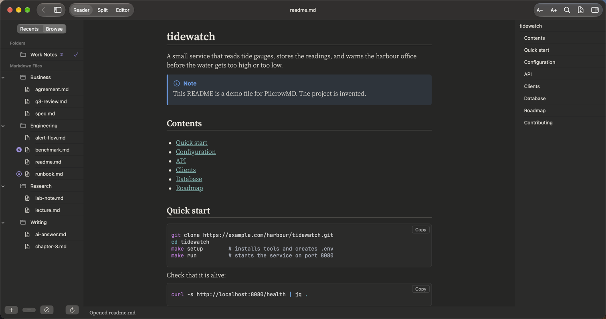
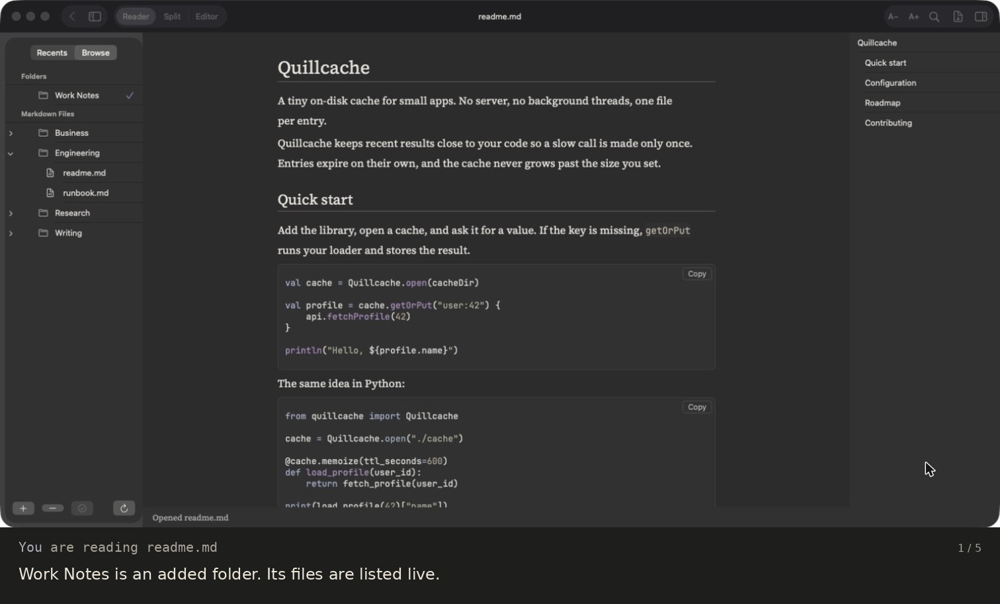
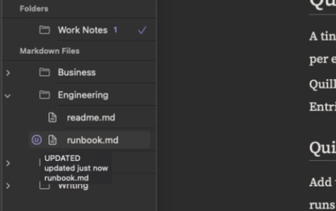
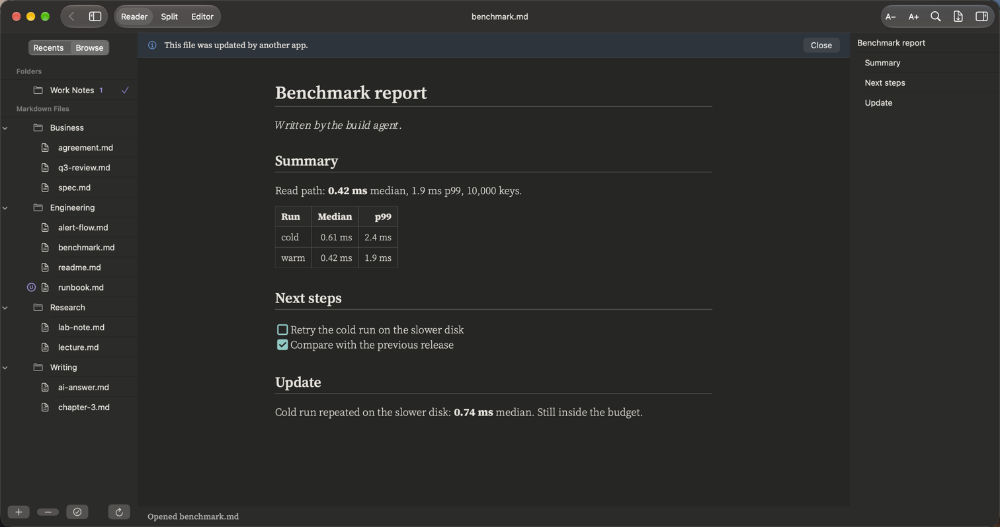
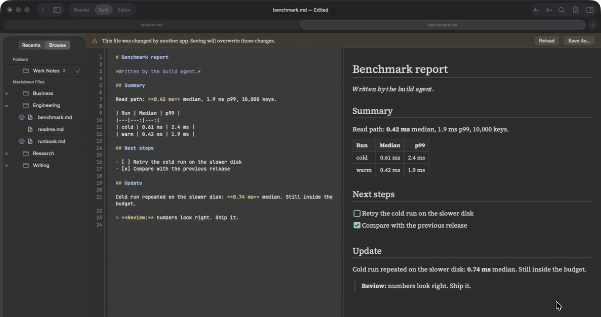
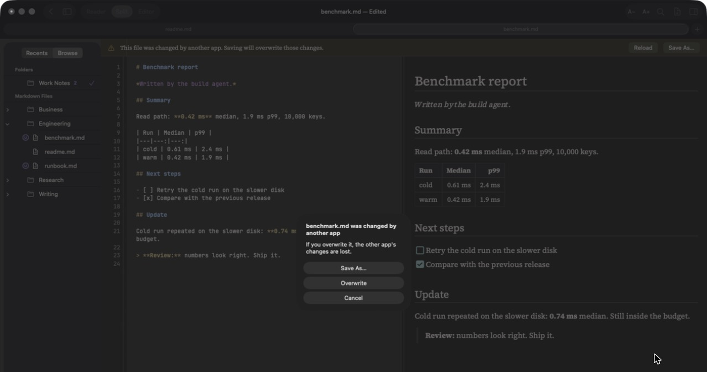
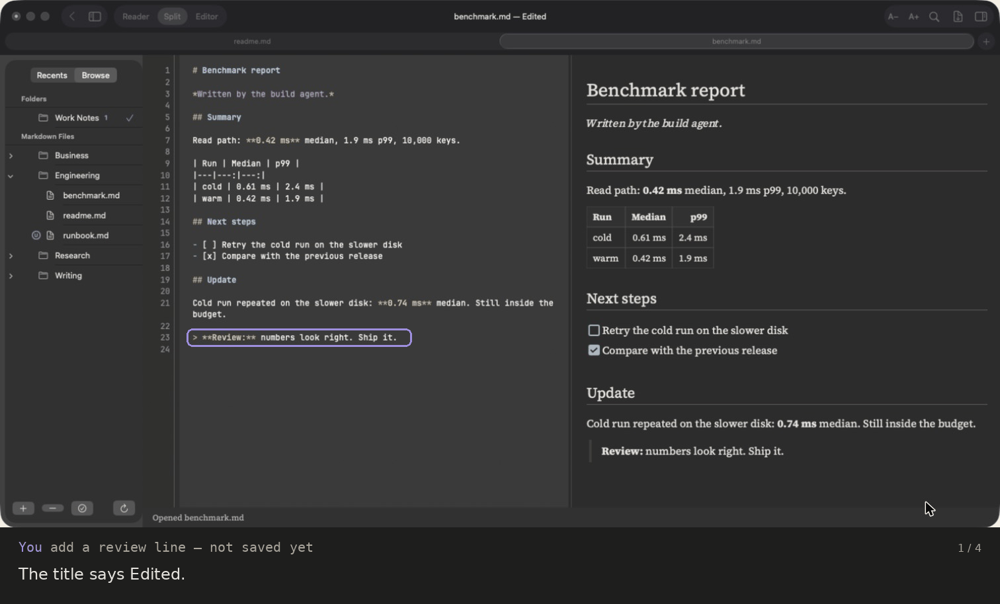

# Folders and agents

Add a folder once. PilcrowMD lists every Markdown file in it and keeps the list live.
When another app – an editor, a sync tool, a script, an AI agent – creates or changes
a file there, you see it within a second. You never have to press refresh.

This page explains what you see, and exactly what the app does and does not do.

---

## Add a folder

1. Open the sidebar (**View › Show Sidebar**, ⌃⌘S) and pick **Browse**.
2. Click **+** (Add Folder) at the bottom and choose a folder.

You can add as many folders as you like. Click a folder name to make it the one you are
working in. That choice stays until you click another folder.

**What is listed**

- Files ending in `.md` or `.markdown` (any capitals).
- Subfolders, as a tree, folders first, in natural order ("note 2" before "note 10").
- Folders with no Markdown files anywhere inside them are not shown.
- Hidden files and folders (names starting with a dot) are not shown.
- Folders reached through a symbolic link are not opened.

**Remove a folder** with **−**. This only removes it from the list. Nothing on disk is touched.

If a folder moves or its permission is lost, it stays in the list marked **Unavailable**,
with **Find Again…** and **Remove Folder**. Find Again lets you point it at the new place.

---

## Live updates

PilcrowMD watches every added folder, including all its subfolders, using the macOS
file-system events service. It does not poll.

| Something happens on disk | What you see |
|---|---|
| A new Markdown file appears | It shows up in the list with an **N** mark |
| A listed file is changed | It gets a **U** mark |
| A file is deleted | It disappears from the list |
| A file is renamed or moved | It shows up under its new name with an **N** mark |
| Many files change at once | One quick refresh, not many |

The list also refreshes when you switch to the app, when you open the Browse section, and
when you click **Refresh Folder** (the circular arrow).

Measured on the beta: a new file shows up **0.3 to 0.8 seconds** after it is written, even with the app in the background.

### The N and U marks

| Mark | Means | Hover text |
|---|---|---|
| **N** in a filled dot | New: the app has not seen this file before | `NEW` · `added 12 min ago` · file name |
| **U** in a ring | Updated: the file's date or size changed since you last opened it | `UPDATED` · `updated 1 h ago` · file name |

- The folder shows how many marked files it holds. A closed subfolder shows its own count.
- A mark clears when you open the file.
- **Mark All as Seen** (bottom bar, or right-click a folder) clears a folder and everything inside it.
- Your own saves never mark a file as updated.
- When you first add a folder, nothing is marked. Marks start from that moment.
- Marks are kept when you quit and reopen the app.

"Changed" is decided by the file's modification time or its size. If a tool rewrites a
file with exactly the same date and size, PilcrowMD cannot tell, and no mark appears.

---

## When the file you have open changes

This is the part that protects your work. There are two cases.

### You have no unsaved edits

The page reloads with the new text, and keeps your scroll position.

A short notice tells you it happened: *"This file was updated by another app."*
**Close** hides it.

### You have unsaved edits

PilcrowMD never mixes the two versions and never overwrites anything on its own.

A banner appears at the top of the document:

> This file was changed by another app. Saving will overwrite those changes.
> **[Reload]** **[Save As…]**

- **Reload** throws away your edits and loads the other app's version. It asks first:
  *"Discard your changes?"*
- **Save As…** keeps your edits in a new file. The other app's file is left as it is.
- Or keep typing. When you save, you get a choice (below).

When you press **⌘S**, close the window, quit, or leave the note through a link or **Back**,
and the file changed on disk, you see this box:

> **"plan.md" was changed by another app**
> If you overwrite it, the other app's changes are lost.
> **[Save As…]** **[Overwrite]** **[Cancel]**

| Button | What happens |
|---|---|
| **Cancel** (default, Esc) | Nothing is written. Your edits stay in the window. |
| **Save As…** | Your edits go to a new file. The other app's file is untouched. |
| **Overwrite** | Your version replaces the other app's version. |

The whole sequence:

### The file is deleted by another app

A banner says *"This file was deleted by another app. Use Save As… to keep it."*
Your text stays in the window. Closing the window asks whether to save it.

---

## Working with AI agents

A common setup: an agent (Claude Code, Codex, a script, a sync job) writes Markdown files
into a project folder while you read and review them in PilcrowMD.

- Point the agent at a folder you have added. New reports and notes appear with **N**.
- Files the agent rewrites get **U**, so you can see at a glance what changed since you last looked.
- If you open a note the agent is still writing, the page follows each save.
- If you are editing a note and the agent saves the same file, you get the banner and,
  when you save, the box above. Nothing is lost without you choosing it.

What PilcrowMD does **not** do yet:

- It does not show *which lines* changed. A "show changes" view is planned.
- It does not keep old versions. Use git, Time Machine or your agent's own history for that.
- It does not lock files. Two apps can still write the same file; PilcrowMD only makes sure
  it never overwrites the other app's work without asking you.

---

## Links between notes

In a note opened from an added folder, Markdown links to other notes open them in the same tab.

| You write | It opens |
|---|---|
| `[plan](plan.md)` | `plan.md` next to this note |
| `[plan](../projects/plan.md)` | a relative path, `..` allowed |
| `[plan](/projects/plan.md)` | a path from the added folder's top |
| `[plan](plan)` | `plan.md`, or `plan.markdown` |
| `[plan](plan.md#budget)` | `plan.md`, at the heading "Budget" |
| `[budget](#budget)` | the heading "Budget" in this note |
| `[plan](<my plan.md>)` | a name with spaces |

- **⌘-click** opens the link in a new tab.
- **Back** (⌘[ or the arrow in the toolbar) returns to the previous note, at the same place.
- A link to a file outside the added folder shows *"Note not found: name"*. Links never
  leave the folder you added.
- Web and email links open in your browser or mail app, only when you click them.
- `[[wiki links]]` are **not** supported; they show as plain text.

If you have unsaved edits, following a link or going Back asks first:
*Save / Cancel / Don't Save*.
