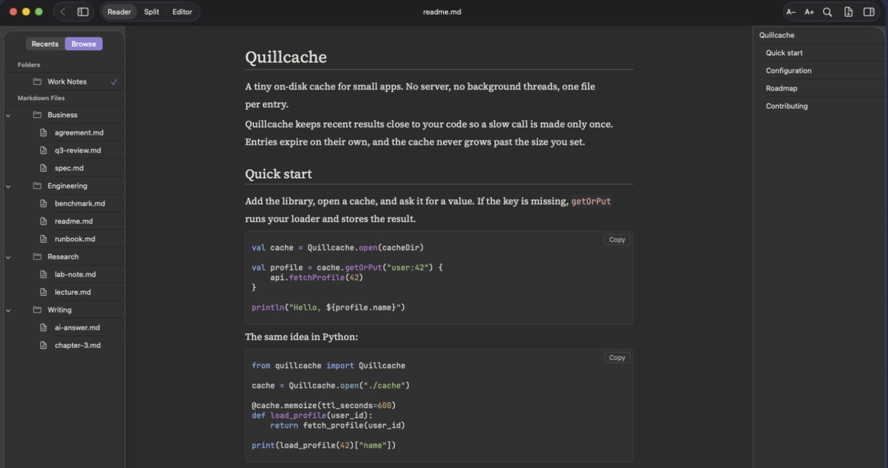
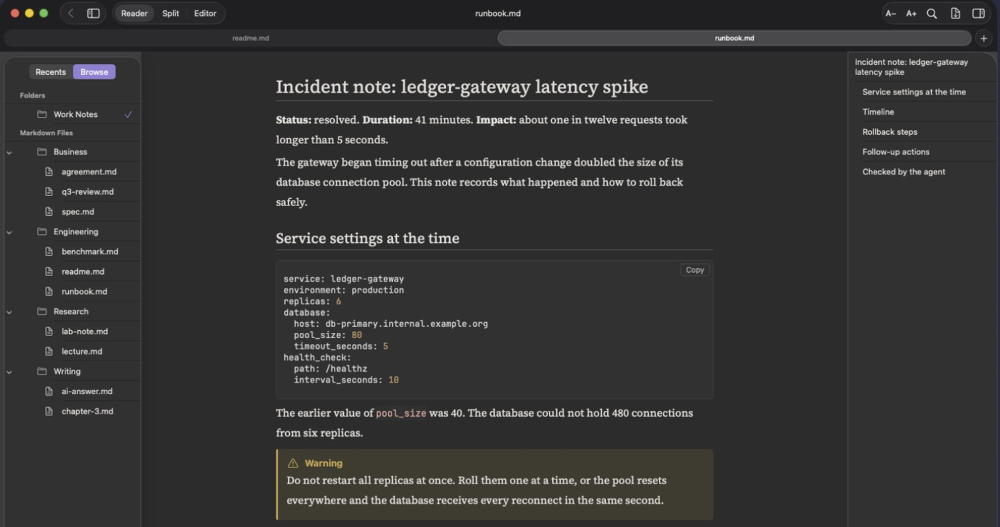
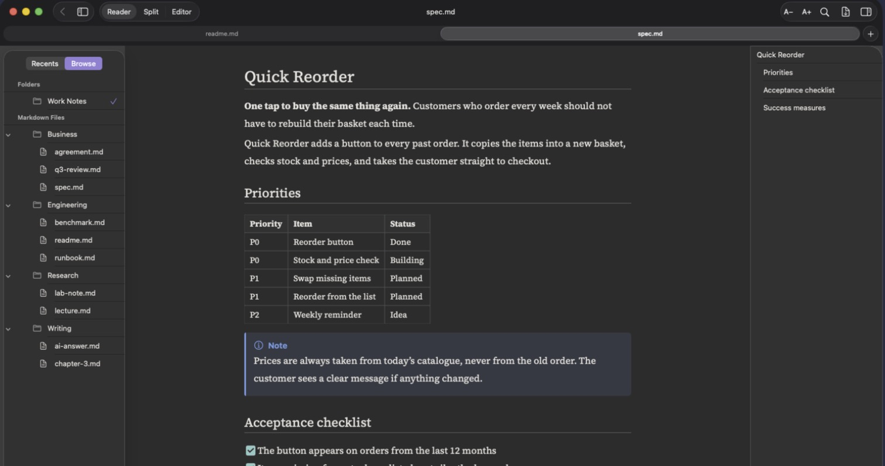
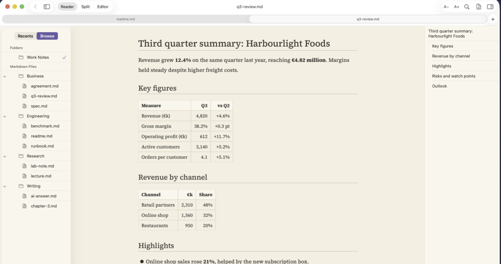
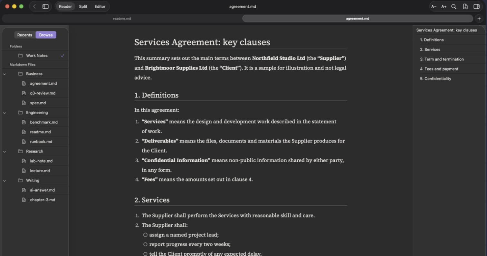
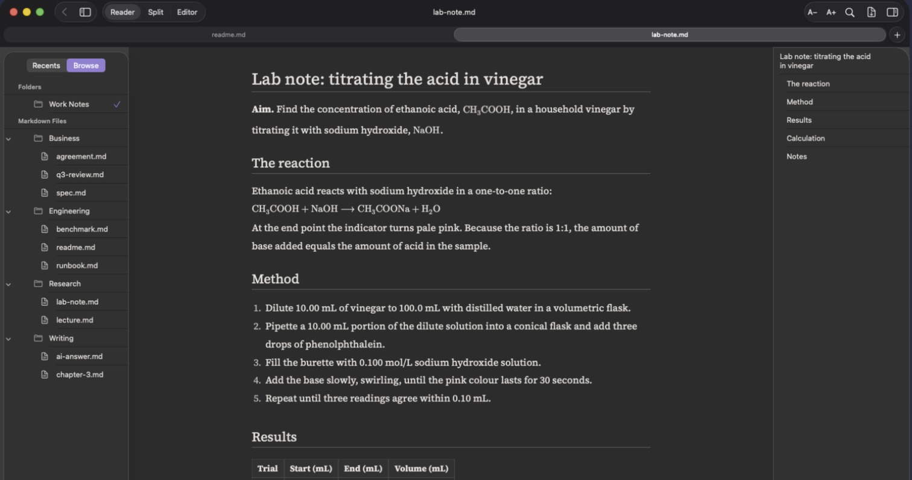
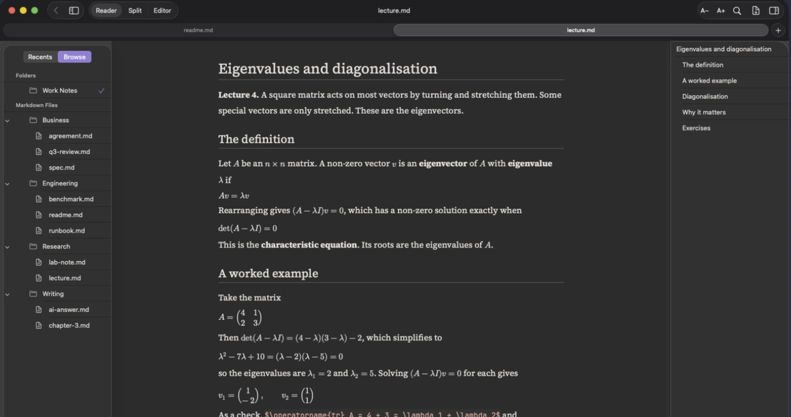
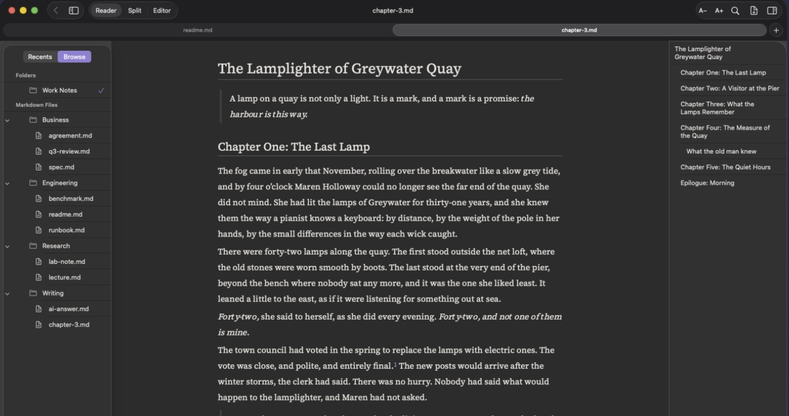
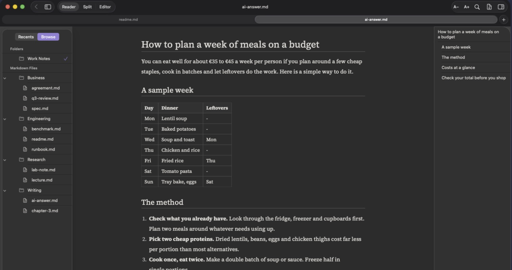
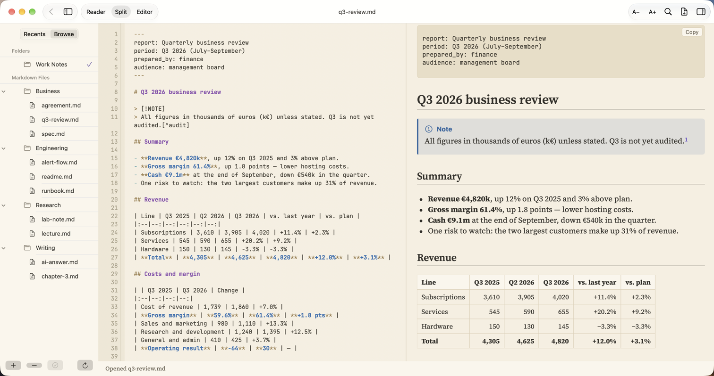

# Who uses PilcrowMD, and how

The same app, nine kinds of documents. Every picture below is the real app (beta) showing
one of our free example files. You can download the files and try them yourself:
[the showcase set](https://github.com/pilcrowmd/pilcrow/tree/main/docs/test-packs/showcase).

---

## Developers – READMEs and project notes

Code blocks with colours for 28 languages, a Copy button on each block, an outline of the
headings on the right. Code is shown exactly as written – no font ligatures.

## Admins and on-call – runbooks and incident notes

Callouts (Note, Tip, Important, Warning, Caution) stand out from the text. Config blocks
keep their exact spacing.

## AI agents – reports you review while they work

Add the folder your agent writes into. New reports appear with an **N**, rewritten ones get
a **U**, and an open report updates as the agent saves it. See [Folders and agents](folders-and-agents.md).

## Product – specs and plans

Tables, task lists and callouts in one page. Split view lets you edit and see the result
side by side.

## Business – reports and reviews

Tables with column alignment for numbers. Light theme for daytime reading and printing.

## Legal – agreements and clause summaries

Numbered clauses keep their numbers, long lines wrap cleanly, and the outline lets you jump
between sections.

## Science – lab notes

Chemical formulas with subscripts, method steps and results tables.

## Maths – lectures and problem sets

Inline `$…$` and display `$$…$$` maths, including matrices. A formula the app cannot draw
is shown as its source text, never dropped.

## Writers – stories and long drafts

A calm reading column, three font sets (Classic, Book, Modern), footnotes you can click.

## Everyone – answers from AI assistants

Paste or save an answer from any AI assistant as a `.md` file and read it the way it was
meant to look: headings, tables, lists.

---

## Edit and see the result together

Split view: Markdown on the left, the page on the right. Here in the Light theme.

