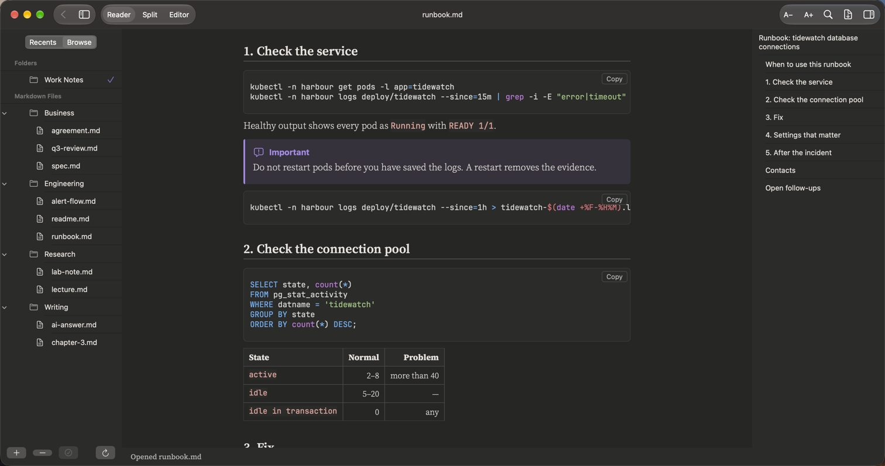
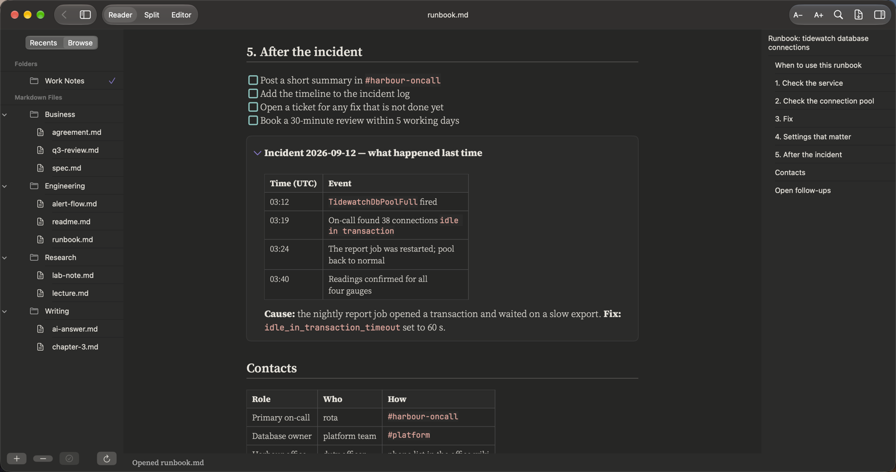

# Admins and on-call

**Runbooks, incident notes and checklists**

A runbook you can follow at 3 a.m. Warnings that stand out, commands with their exact spacing, and a checklist for after the incident.

## What it renders in this note

| Element | In this note |
|:--|:--|
| Front matter | Service, owner and review date at the top |
| Callouts | Caution, Important and Warning boxes in their own colours |
| Code blocks | Shell commands, SQL queries and YAML settings, spacing kept exactly |
| Tables | Alerts, normal values and contacts |
| Task lists | The after-incident checklist |
| Collapsible section | The timeline of the last incident, folded away until you need it |

## More pictures

*Shell and SQL blocks with an Important callout.*

*The incident timeline opened from its collapsible section.*

## Try it yourself

The note in the pictures: [runbook.md](../../samples/Work%20Notes/Engineering/runbook.md).
Download the repo, add the `samples/Work Notes` folder in PilcrowMD (Browse › **+**), and open it. See [samples](../../samples/).

## Good to know

- Callouts use the GitHub style: `> [!WARNING]`. Five kinds: Note, Tip, Important, Warning, Caution.
- Add the folder your runbooks live in. When a colleague updates one, it gets a **U** mark.

---

[All use cases](../use-cases.md) · [What it does](../what-it-does.md) · [README](../../README.md)
