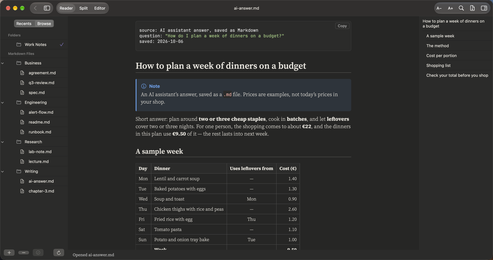
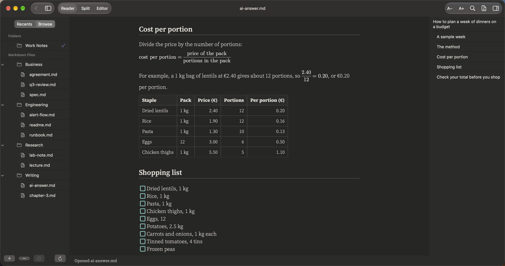
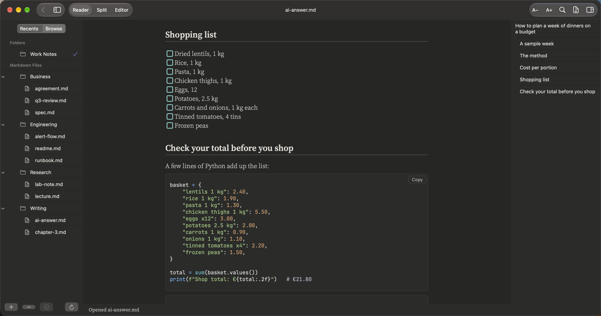

# AI answers

**Answers from AI assistants, saved as Markdown**

AI assistants answer in Markdown. Save the answer as a `.md` file and it reads like a page, not a wall of symbols: tables, steps, code, a formula and a checklist.

## What it renders in this note

| Element | In this note |
|:--|:--|
| Front matter | Where the answer came from, and when |
| Tables | The week plan and the cost table |
| Numbered and nested lists | The method |
| Maths | The cost-per-portion formula |
| Task list | The shopping list |
| Code block | A few lines of Python |
| Callouts | Note, Tip and Warning boxes |
| Collapsible section and footnote | A recipe and a source note |

## More pictures

*The formula and the cost table.*

*The shopping list and the code block.*

## Try it yourself

The note in the pictures: [ai-answer.md](../../samples/Work%20Notes/Writing/ai-answer.md).
Download the repo, add the `samples/Work Notes` folder in PilcrowMD (Browse › **+**), and open it. See [samples](../../samples/).

## Good to know

- Most AI assistants can give their answer as Markdown. Save it with a `.md` ending, in a folder you added.

---

[All use cases](../use-cases.md) · [What it does](../what-it-does.md) · [README](../../README.md)
