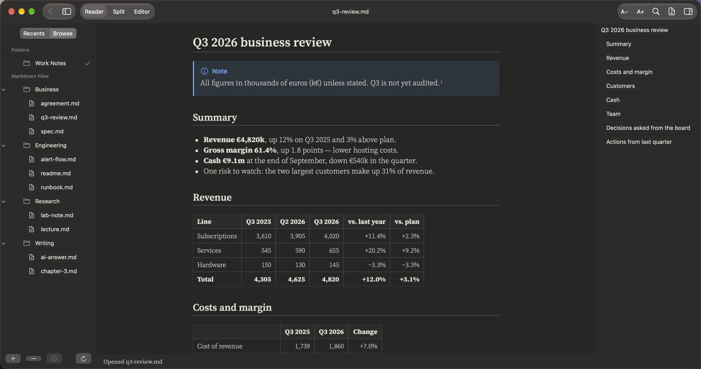
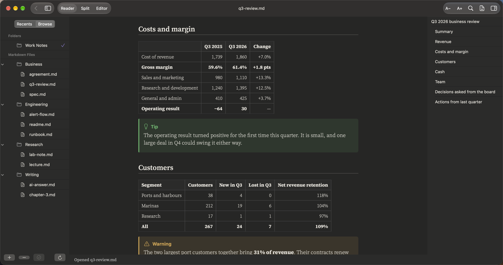
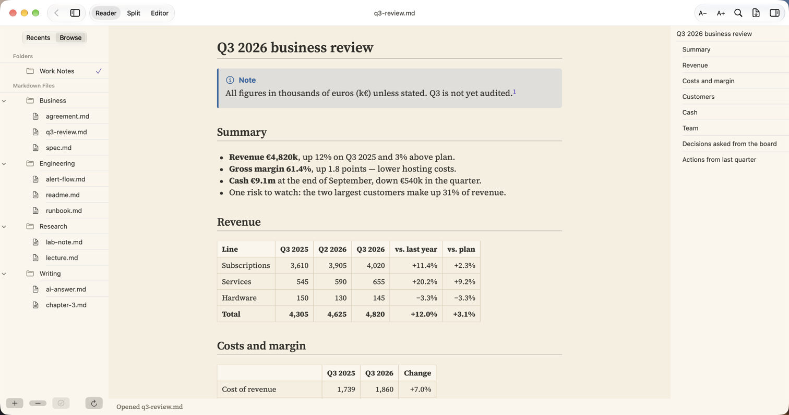

# Business and finance

**Reports, reviews and board papers**

A quarterly review with real tables: numbers lined up on the right, totals in bold, and the risks called out where nobody can miss them.

## What it renders in this note

| Element | In this note |
|:--|:--|
| Front matter | Report, period and audience |
| Tables | Revenue, costs, customers, cash and team, numbers aligned right |
| Bold totals | Totals stand out inside the tables |
| Callouts | Note, Tip and Warning boxes |
| Numbered and task lists | Decisions for the board, actions from last quarter |
| Collapsible section | How a measure is counted |
| Footnotes | The audit date |

## More pictures

*Costs and customers, with the Warning callout.*

*The same report in the Light theme.*

## Try it yourself

The note in the pictures: [q3-review.md](../../samples/Work%20Notes/Business/q3-review.md).
Download the repo, add the `samples/Work Notes` folder in PilcrowMD (Browse › **+**), and open it. See [samples](../../samples/).

## Good to know

- **File › Export as PDF…** (⇧⌘E) turns the report into a PDF to send.
- Light and Dark themes. The Light theme is easier for printing and daylight.

---

[All use cases](../use-cases.md) · [What it does](../what-it-does.md) · [README](../../README.md)
