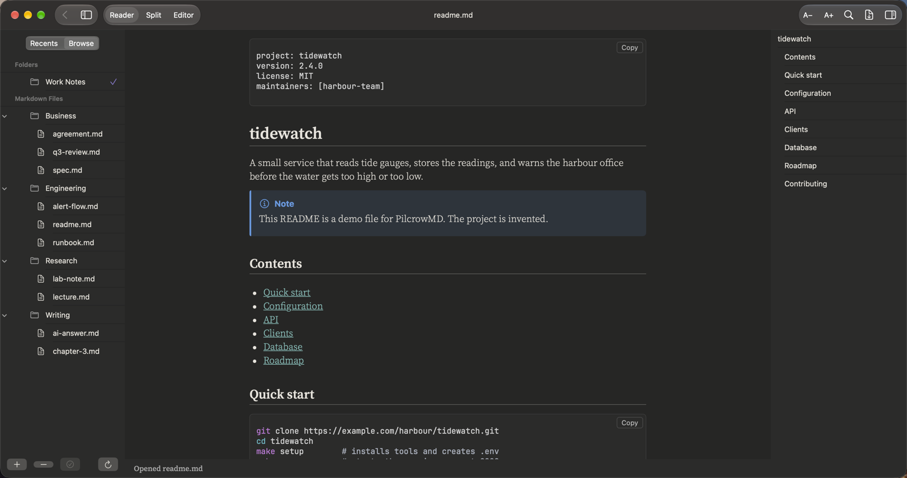
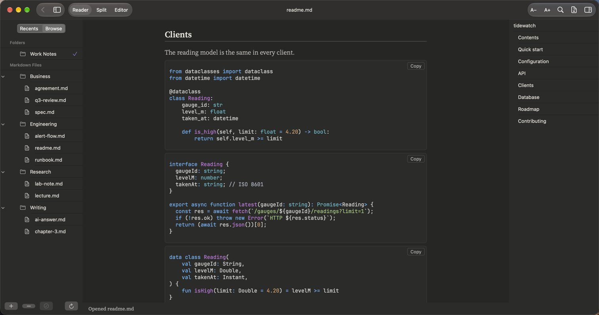
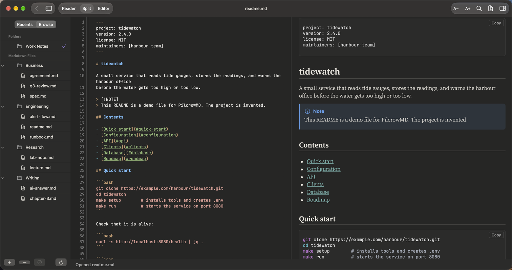

# Developers

**READMEs, API notes and project docs**

A project README the way GitHub shows it – and then some. Code in many languages, each with its own colours and a Copy button. Tables for settings and endpoints. Task lists for the roadmap.

## What it renders in this note

| Element | In this note |
|:--|:--|
| Front matter | The `---` block at the top, shown as a YAML box |
| Code blocks | Bash, JSON, YAML, Python, TypeScript, Kotlin, Swift, Go, Rust and SQL in one note – colours for 28 languages in all, Copy button on each |
| Tables | Settings and API endpoints, with column alignment |
| Callouts | Note, Tip and Warning boxes |
| Task lists | The roadmap, with ticked and open items |
| Links inside the note | The table of contents jumps to each heading |
| Collapsible section | A `
` block for the long explanation |
| Footnotes | Click to jump down and back |

## More pictures

*Code in Python, TypeScript and Kotlin, each with its own colours.*

*Split view: the Markdown on the left, the page on the right.*

## Try it yourself

The note in the pictures: [readme.md](../../samples/Work%20Notes/Engineering/readme.md).
Download the repo, add the `samples/Work Notes` folder in PilcrowMD (Browse › **+**), and open it. See [samples](../../samples/).

## Good to know

- Code is shown exactly as typed, in JetBrains Mono, without font ligatures.
- The language name after the three backticks must be lower case: `python`, not `Python`.
- Mermaid diagrams are off by default. When you turn them on, each diagram is sent to mermaid.ink to be drawn.

---

[All use cases](../use-cases.md) · [What it does](../what-it-does.md) · [README](../../README.md)
