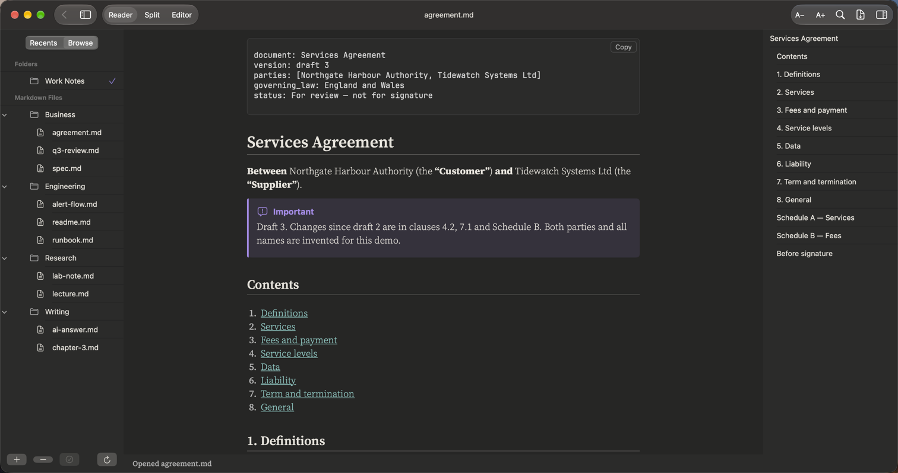
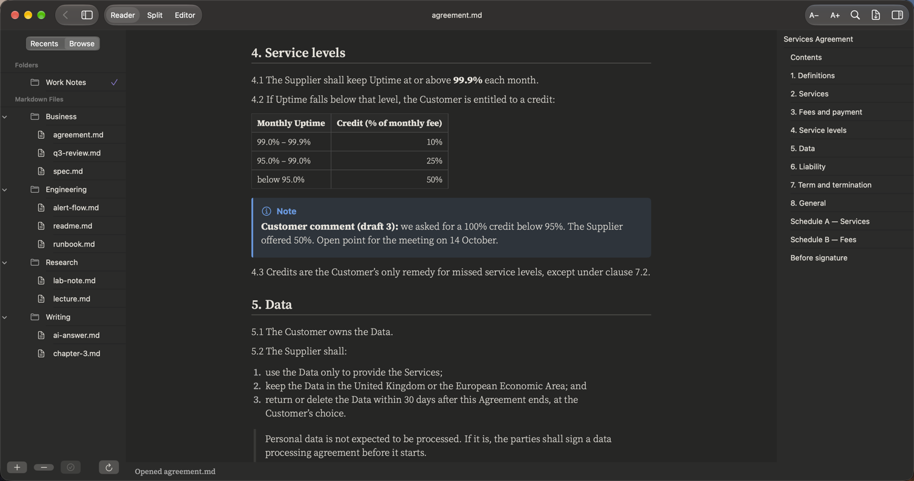
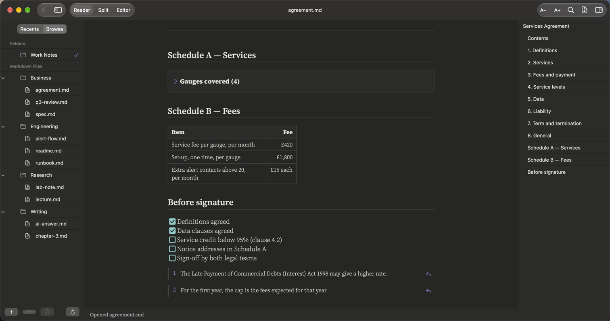

# Legal

**Agreements, clauses and review drafts**

A draft agreement you can review on screen: numbered clauses, a definitions table, comments in their own boxes, and a checklist of what is still open.

## What it renders in this note

| Element | In this note |
|:--|:--|
| Front matter | Document, version, parties and status |
| Contents with links | Click a clause number to jump to it |
| Numbered clauses | Clause numbers and sub-lists keep their numbers |
| Definitions table | Terms in bold, meanings beside them |
| Callouts | Review comments in Note and Important boxes |
| Quotes | A side condition set apart from the clauses |
| Footnotes | Legal references at the bottom |
| Collapsible schedule | Schedule A folded away |
| Task list | What must be agreed before signature |

## More pictures

*The service-credit clause, its table and a review comment.*

*Schedules, the signing checklist and footnotes.*

## Try it yourself

The note in the pictures: [agreement.md](../../samples/Work%20Notes/Business/agreement.md).
Download the repo, add the `samples/Work Notes` folder in PilcrowMD (Browse › **+**), and open it. See [samples](../../samples/).

## Good to know

- The **Outline** (⌥⌘0) lists every heading. Click one to jump.
- PilcrowMD does not track changes or compare versions. A compare view is planned.

---

[All use cases](../use-cases.md) · [What it does](../what-it-does.md) · [README](../../README.md)
