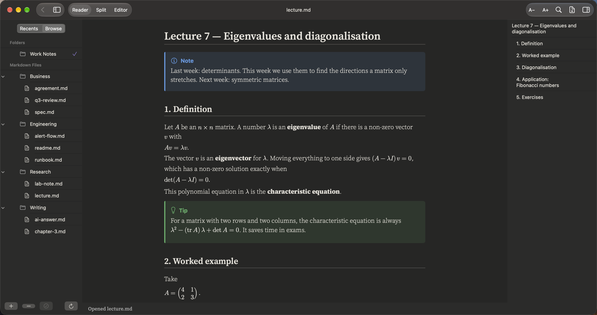
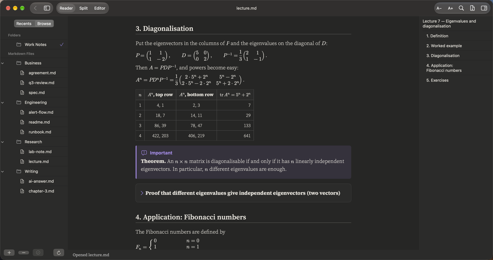
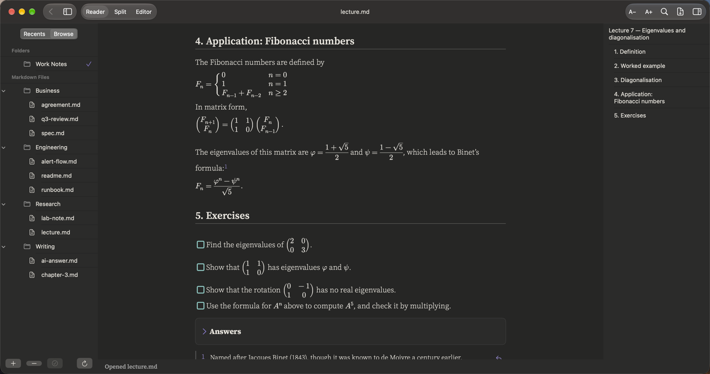

# Maths

**Lectures, problem sets and proofs**

A lecture with real maths: matrices, aligned equations, cases, fractions and roots – written in the usual `$…$` and `$$…$$` notation.

## What it renders in this note

| Element | In this note |
|:--|:--|
| Inline maths | $…$ inside sentences |
| Display maths | $$…$$ on its own line |
| Matrices | `pmatrix` in equations and in table cells |
| Aligned equations and cases | `aligned` and `cases` blocks |
| Callouts | A theorem in an Important box, a Tip for exams |
| Collapsible sections | A proof and the answers, hidden until you open them |
| Task list | The exercises |

## More pictures

*Diagonalisation and the table of powers.*

*The Fibonacci section with cases and Binet's formula.*

## Try it yourself

The note in the pictures: [lecture.md](../../samples/Work%20Notes/Research/lecture.md).
Download the repo, add the `samples/Work Notes` folder in PilcrowMD (Browse › **+**), and open it. See [samples](../../samples/).

## Good to know

- `$5 and $10` stays as text – a dollar sign before a number is not read as maths.
- Maths is drawn on your Mac. Nothing is sent online.
- Not every LaTeX command is supported (for example `\operatorname` and `\blacksquare`). A formula the app cannot draw is shown as its source text.

---

[All use cases](../use-cases.md) · [What it does](../what-it-does.md) · [README](../../README.md)
