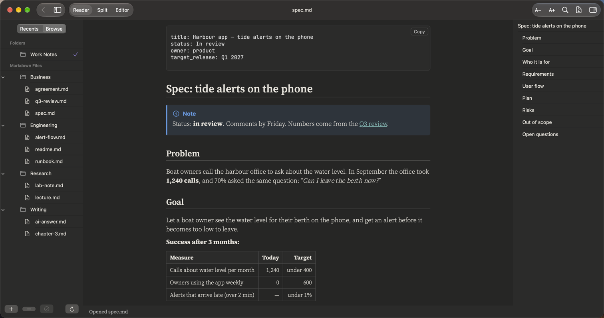
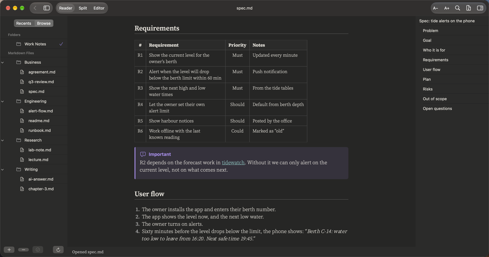
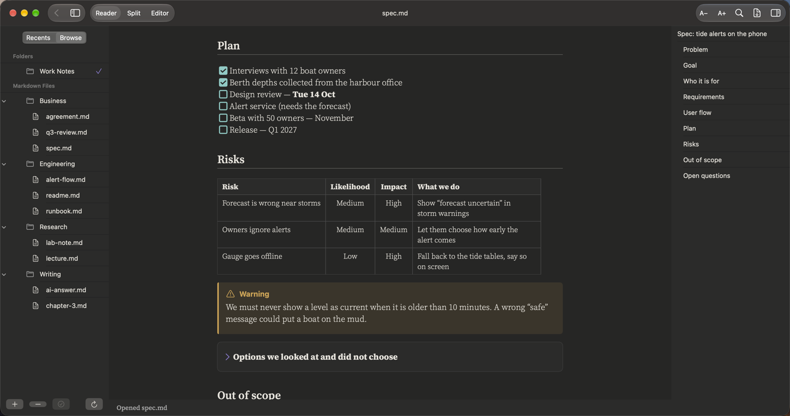

# Product teams

**Specs, plans and requirement lists**

A spec with everything in one page: goals in a table, requirements with priorities, the plan as a checklist, and links to the other notes it depends on.

## What it renders in this note

| Element | In this note |
|:--|:--|
| Front matter | Title, status, owner and target release |
| Tables | Success measures, requirements, risks |
| Task lists | The plan, ticked as you go |
| Callouts | Note, Important and Warning boxes |
| Links between notes | To the Q3 review and to the engineering README, straight to the right heading |
| Collapsible section | Options we did not choose |
| Footnotes | For side remarks |

## More pictures

*Requirements with priorities and an Important callout.*

*The plan as a task list, and the risks table with a Warning.*

## Try it yourself

The note in the pictures: [spec.md](../../samples/Work%20Notes/Business/spec.md).
Download the repo, add the `samples/Work Notes` folder in PilcrowMD (Browse › **+**), and open it. See [samples](../../samples/).

## Good to know

- Links between notes work inside a folder you added: `[Q3 review](q3-review.md#customers)` opens that note at that heading.
- ⌘-click opens a link in a new tab. **Back** (⌘[) returns to where you were.

---

[All use cases](../use-cases.md) · [What it does](../what-it-does.md) · [README](../../README.md)
