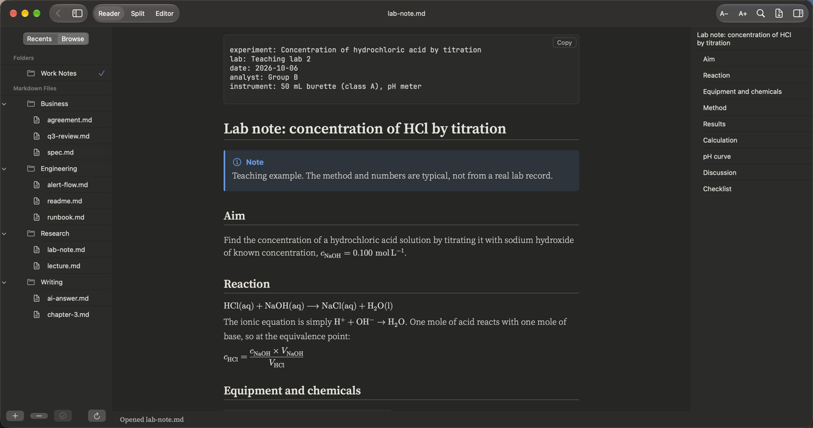
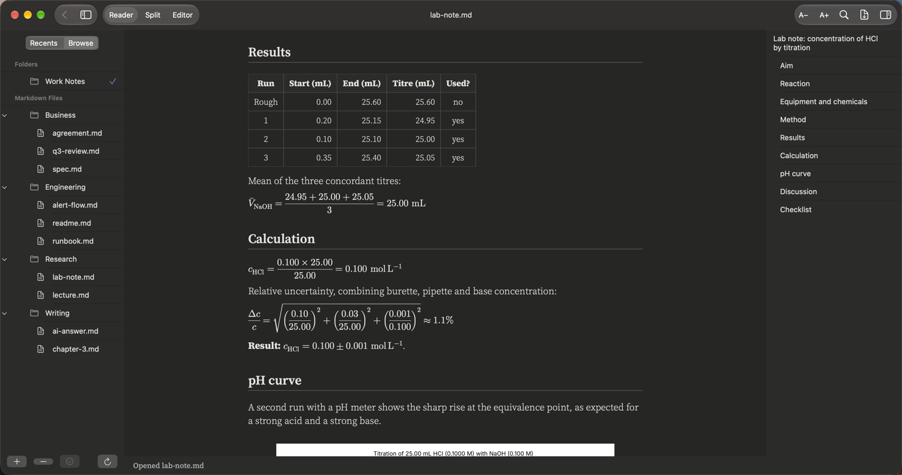
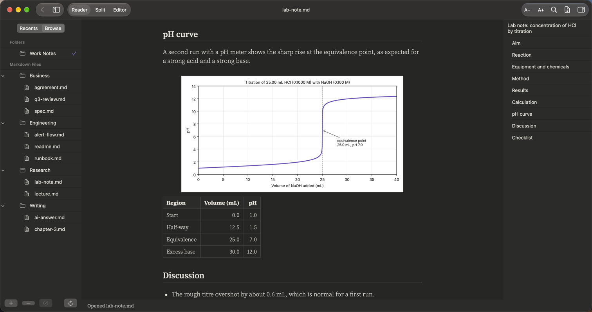

# Science

**Lab notes, methods and results**

A lab note with formulas, units and results in tables – and the chart from the experiment, shown right in the page.

## What it renders in this note

| Element | In this note |
|:--|:--|
| Front matter | Experiment, lab, date and instrument |
| Maths | Reaction equations, fractions and an uncertainty formula, inline and on their own line |
| Tables | Equipment, titres and pH readings |
| Local picture | The pH curve, a PNG next to the note |
| Callouts | Note and Caution boxes |
| Collapsible section | Raw readings |
| Task list and footnotes | The checklist and a note on drop size |

## More pictures

*The results table and the calculation.*

*The pH curve shown in the page.*

## Try it yourself

The note in the pictures: [lab-note.md](../../samples/Work%20Notes/Research/lab-note.md).
Download the repo, add the `samples/Work Notes` folder in PilcrowMD (Browse › **+**), and open it. See [samples](../../samples/).

## Good to know

- Pictures must be files on your Mac (up to 50 MB). Pictures from the web are never downloaded – a box shows their description instead.
- A formula the app cannot draw is shown as its source text, never dropped.

---

[All use cases](../use-cases.md) · [What it does](../what-it-does.md) · [README](../../README.md)
