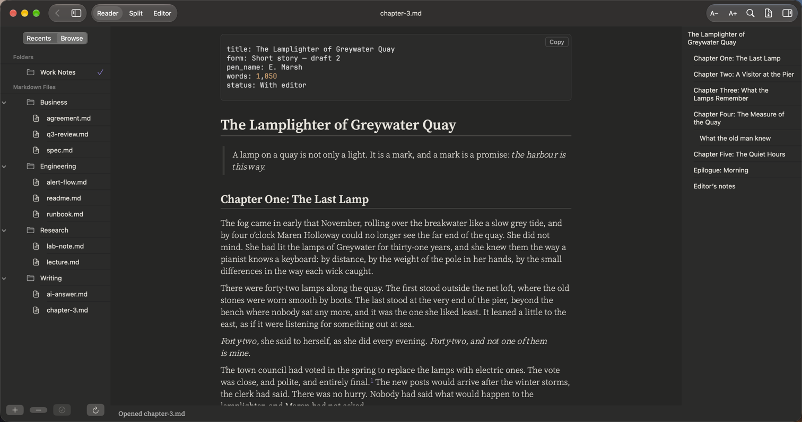
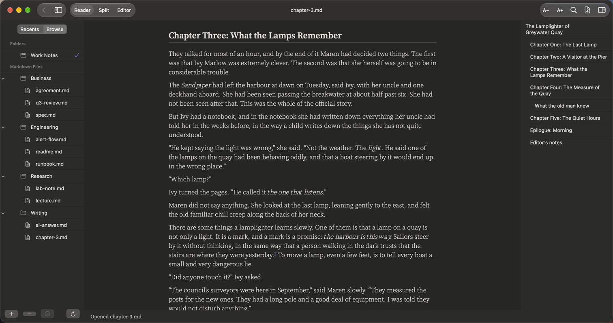
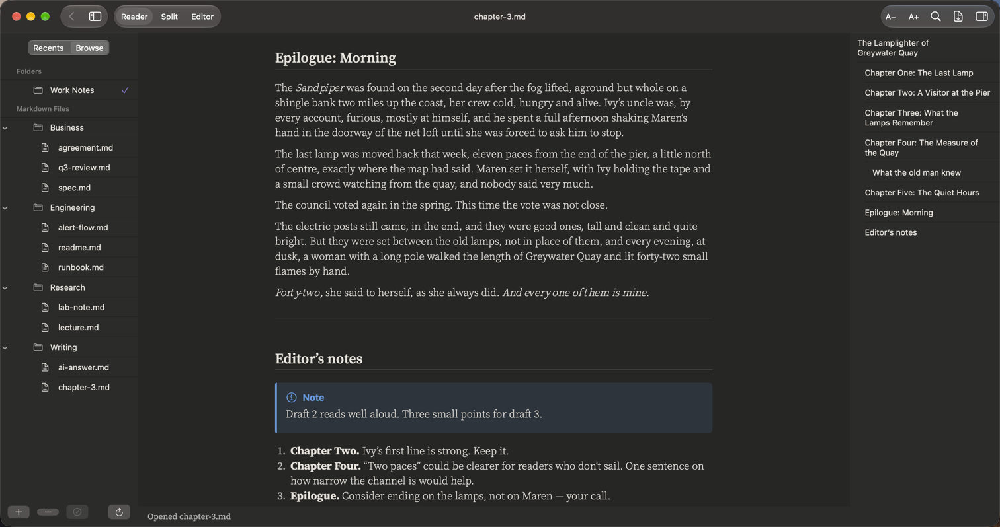

# Writers

**Chapters, drafts and editor's notes**

Long text that is easy to read: a calm serif font, italics and quotes as they should look, footnotes you can click, and the editor's notes at the end.

## What it renders in this note

| Element | In this note |
|:--|:--|
| Front matter | Title, form, word count and status |
| Long text | Comfortable line length, three font sets to choose from |
| Italics and bold | For thoughts, names and emphasis |
| Quotes | The epigraph and quoted passages |
| Scene breaks | `* * *` and `---` lines |
| Footnotes | Click to jump down and back |
| Callout, list and collapsible table | The editor's notes and chapter word counts |

## More pictures

*A passage with a quote and a footnote.*

*The epilogue and the editor's notes.*

## Try it yourself

The note in the pictures: [chapter-3.md](../../samples/Work%20Notes/Writing/chapter-3.md).
Download the repo, add the `samples/Work Notes` folder in PilcrowMD (Browse › **+**), and open it. See [samples](../../samples/).

## Good to know

- Fonts: Classic (Source Serif 4), Book (Merriweather), Modern (Atkinson Hyperlegible). Settings › Appearance.
- Text size from 85% to 160%: ⌘+ and ⌘−.

---

[All use cases](../use-cases.md) · [What it does](../what-it-does.md) · [README](../../README.md)
