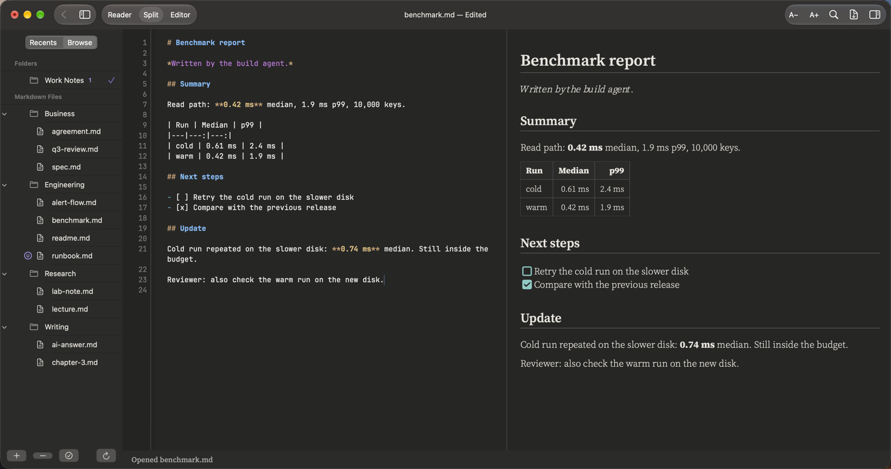

# What PilcrowMD does – and what it does not

A plain list. If something is not on the "does" side, assume it is not there yet.

---

## Reading and writing

| Feature | Details |
|---|---|
| **Three modes** | **Read** (⌥⌘1) the rendered page · **Split** (⌥⌘2) editor and page side by side · **Edit** (⌥⌘3) the Markdown text |
| **Tabs** | Several documents in one window (⌘T). Each tab keeps its own mode, position and history. |
| **Sidebar** | **Recents** (last 10 files) and **Browse** (your added folders) – see [Folders and agents](folders-and-agents.md) |
| **Outline** | The headings of the open note, on the right (⌥⌘0). Click one to jump. |
| **Find** | ⌘F in the open note. Next ⌘G, previous ⇧⌘G. Not case-sensitive. Searches the page in Read mode, the text in Edit mode. No replace, no whole-word, no patterns yet. |
| **Text size** | A− / A+ in the toolbar, ⌘− / ⌘+, reset ⌘0. 85% to 160%. |
| **Themes** | Dark (default) and Light. No "follow the system" option yet. |
| **Fonts** | Classic (Source Serif 4), Book (Merriweather), Modern (Atkinson Hyperlegible). Code uses JetBrains Mono, without ligatures. |
| **Export** | **File › Export as PDF…** (⇧⌘E) |
| **Editor** | Line numbers (can be turned off), syntax colours for Markdown, undo/redo |

---

## Markdown it draws

| Element | Notes |
|---|---|
| Headings, paragraphs, **bold**, *italic*, ~~strike~~, `code` | |
| Lists, numbered lists, task lists `- [ ]` / `- [x]` | Task boxes are drawn as ticked or empty boxes |
| Quotes | |
| Tables | Column alignment; wide tables scroll sideways |
| Code blocks | Colours for 28 languages (Swift, Kotlin, Python, JavaScript, TypeScript, Rust, Go, Java, C, C++, C#, SQL, YAML, JSON, Bash, CSS, HTML/XML, LaTeX and more). The fence name must be lower case: `python`, not `Python`. Copy button on each block. |
| Math | `$…$` inline, `$$…$$` display. `$5 and $10` stays text. A formula that cannot be drawn is shown as its source. |
| Footnotes | `[^1]` – click to jump and back |
| Callouts | `> [!NOTE]`, `[!TIP]`, `[!IMPORTANT]`, `[!WARNING]`, `[!CAUTION]` |
| Collapsible sections | `

…
…
` |
| Front matter | The `---` block at the top, shown as a YAML box |
| Pictures | Local pictures up to 50 MB. **Web pictures are never downloaded** – a box shows the description and the address instead. |
| Links | Web links, email, links between notes, heading links. Bare `https://…`, `www.…` and email addresses become links. |
| Mermaid diagrams | **Off by default.** When you turn it on, each diagram's text is sent to mermaid.ink to be drawn. Off, it is shown as code. |

Pictures of each kind of document: [Use cases](use-cases.md).

## Markdown it shows as plain text

These never crash the app and never damage the text around them. They are simply shown
as you typed them:

- `[[wiki links]]`
- `==highlight==`, `~sub~`, `^super^`
- `:emoji:` codes
- HTML (other than `
`)

---

## Privacy

- No accounts, no tracking, no analytics, no ads.
- The app makes **no network connections**, with one exception you must switch on yourself:
  Mermaid diagrams (Settings › Reader). Then each diagram's text is sent to mermaid.ink.
- Web pictures in your notes are never fetched.
- Links open in your browser only when you click them.

---

## Settings

| Tab | Setting | Default |
|---|---|---|
| General | Open documents ready to write, not to read | Off |
| General | Open documents in: Tabs / New Windows / Follow System Settings | Tabs |
| Appearance | Theme: Dark / Light | Dark |
| Appearance | Reading and code font: Classic / Book / Modern | Classic |
| Reader | Preview text size | 100% |
| Reader | Wrap long lines in code blocks | Off |
| Reader | Mermaid diagrams (online) | Off |
| Editor | Edit text size | 100% |
| Editor | Line numbers | On |

---

## Keyboard shortcuts

| Action | Keys |
|---|---|
| New · New Tab · New Window | ⌘N · ⌘T · ⌥⌘N |
| Open · Close | ⌘O · ⌘W |
| Save · Save As | ⌘S · ⇧⌘S |
| Export as PDF | ⇧⌘E |
| Find · Next · Previous | ⌘F · ⌘G · ⇧⌘G |
| Read · Split · Edit | ⌥⌘1 · ⌥⌘2 · ⌥⌘3 |
| Sidebar · Outline | ⌃⌘S · ⌥⌘0 |
| Back (between notes) | ⌘[ |
| Text bigger · smaller · reset | ⌘+ · ⌘− · ⌘0 |
| Settings | ⌘, |

---

## System

- macOS 14 (Sonoma) or later.
- Tested on Apple Silicon. The download also contains an Intel build, which has not been tested.
- Not signed or notarized by Apple yet – the first open needs one extra step ([Install](../INSTALL.md)).
- Not sandboxed. It reads and writes only the files and folders you open or add.
- Opens `.md`, `.markdown` and `.txt` files.
