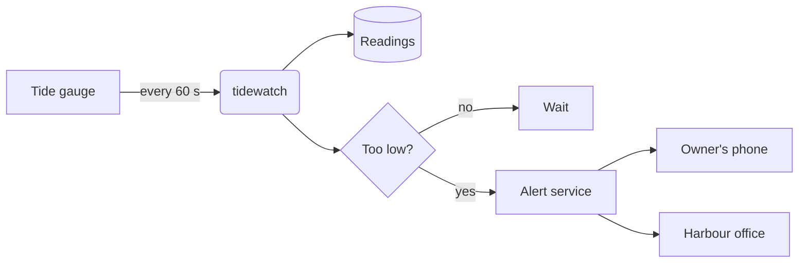

# How a tide alert travels

From the gauge on the pier to the phone of a boat owner – in under a minute.

| Step | Target time |
|:--|--:|
| Gauge to tidewatch | 5 s |
| Check and forecast | 10 s |
| Alert to the phone | 30 s |

> [!NOTE]
> This diagram is drawn by Mermaid. In PilcrowMD, Mermaid is off until you switch it on in
> Settings › Reader; then the diagram text is sent to mermaid.ink to be drawn.
