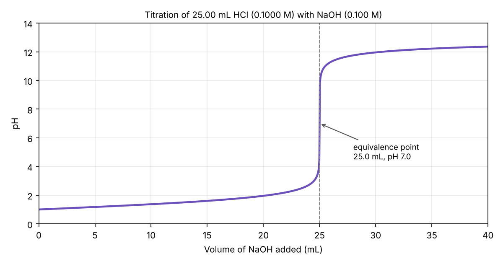

# Lab note: concentration of HCl by titration

> [!NOTE]
> Teaching example. The method and numbers are typical, not from a real lab record.

## Aim

Find the concentration of a hydrochloric acid solution by titrating it with sodium hydroxide
of known concentration, $c_{\mathrm{NaOH}} = 0.100\ \mathrm{mol\,L^{-1}}$.

## Reaction

$$
\mathrm{HCl(aq)} + \mathrm{NaOH(aq)} \longrightarrow \mathrm{NaCl(aq)} + \mathrm{H_2O(l)}
$$

The ionic equation is simply $\mathrm{H^+ + OH^- \rightarrow H_2O}$. One mole of acid reacts
with one mole of base, so at the equivalence point:

$$
c_{\mathrm{HCl}} = \frac{c_{\mathrm{NaOH}} \times V_{\mathrm{NaOH}}}{V_{\mathrm{HCl}}}
$$

## Equipment and chemicals

| Item | Details |
|:--|:--|
| Burette | 50.00 mL, class A, ±0.05 mL |
| Pipette | 25.00 mL, class A, ±0.03 mL |
| Indicator | Phenolphthalein, 2 drops |
| Base | $\mathrm{NaOH}$, 0.100 mol/L (standardised) |
| Acid | $\mathrm{HCl}$, unknown concentration |

> [!CAUTION]
> Sodium hydroxide harms the eyes. Wear goggles for the whole session.

## Method

1. Rinse the burette with NaOH solution, then fill it and note the start reading.
2. Pipette 25.00 mL of HCl into a conical flask and add 2 drops of phenolphthalein.
3. Add NaOH until a faint pink colour stays for 30 seconds.
4. Note the end reading. Repeat until three titres agree within 0.10 mL.

## Results

| Run | Start (mL) | End (mL) | Titre (mL) | Used? |
|:--:|--:|--:|--:|:--:|
| Rough | 0.00 | 25.60 | 25.60 | no |
| 1 | 0.20 | 25.15 | 24.95 | yes |
| 2 | 0.10 | 25.10 | 25.00 | yes |
| 3 | 0.35 | 25.40 | 25.05 | yes |

Mean of the three concordant titres:

$$
\bar{V}_{\mathrm{NaOH}} = \frac{24.95 + 25.00 + 25.05}{3} = 25.00\ \mathrm{mL}
$$

## Calculation

$$
c_{\mathrm{HCl}} = \frac{0.100 \times 25.00}{25.00} = 0.100\ \mathrm{mol\,L^{-1}}
$$

Relative uncertainty, combining burette, pipette and base concentration:

$$
\frac{\Delta c}{c} = \sqrt{\left(\frac{0.10}{25.00}\right)^2 + \left(\frac{0.03}{25.00}\right)^2 + \left(\frac{0.001}{0.100}\right)^2} \approx 1.1\%
$$

**Result:** $c_{\mathrm{HCl}} = 0.100 \pm 0.001\ \mathrm{mol\,L^{-1}}$.

## pH curve

A second run with a pH meter shows the sharp rise at the equivalence point, as expected for
a strong acid and a strong base.

| Region | Volume (mL) | pH |
|:--|--:|--:|
| Start | 0.0 | 1.0 |
| Half-way | 12.5 | 1.5 |
| Equivalence | 25.0 | 7.0 |
| Excess base | 30.0 | 12.0 |

## Discussion

- The rough titre overshot by about 0.6 mL, which is normal for a first run.
- Phenolphthalein changes colour between pH 8.2 and 10.0. On this curve that range sits
  inside the steep part, so the indicator error is below one drop.[^drop]
- The largest source of uncertainty is the stated concentration of the base.

Raw pH-meter readings

| Volume (mL) | 0 | 5 | 10 | 15 | 20 | 24 | 25 | 26 | 30 | 35 |
|:--|--:|--:|--:|--:|--:|--:|--:|--:|--:|--:|
| pH | 1.00 | 1.18 | 1.37 | 1.60 | 1.95 | 2.69 | 7.00 | 11.29 | 11.96 | 12.22 |

## Checklist

- [x] Burette rinsed with NaOH
- [x] Three concordant titres
- [x] Waste neutralised before disposal
- [ ] Results entered in the shared sheet

[^drop]: One drop from this burette is about 0.05 mL.
